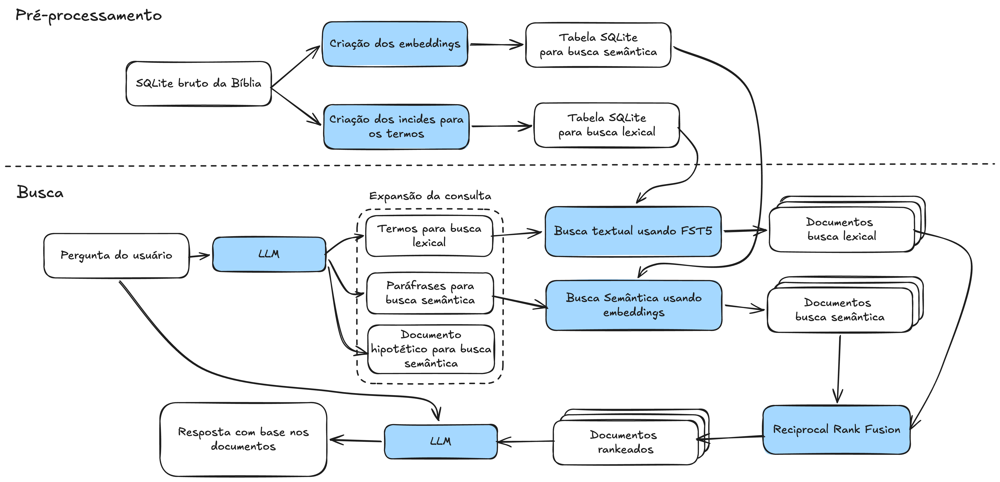
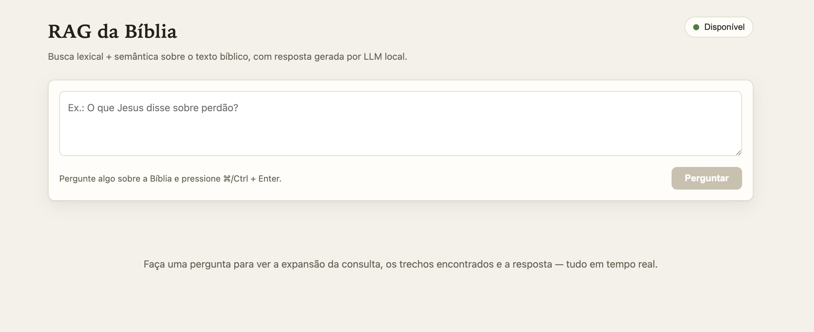

# RAG da Bíblia

RAG (Retrieval-Augmented Generation) **100% local** sobre o texto bíblico. O
projeto recupera capítulos e trechos relevantes para a pergunta do usuário —
combinando busca lexical (FTS5) e busca semântica (embeddings) — e usa um LLM
local para escrever a resposta citando testamento, livro, capítulo e versículo.

Todo o processamento (LLM, embeddings e contagem de tokens) roda através do
[LM Studio](https://lmstudio.ai/) na sua máquina. Nenhum dado sai do computador.

## Como funciona

O fluxo tem duas etapas: um **pré-processamento** que transforma um SQLite bruto
da Bíblia em um SQLite com indices apropriados para busca, e a **busca** propriamente dita.



### Pré-processamento (`preprocessor`)

O `preprocessor` lê os versículos do SQLite de entrada e os agrupa por capítulo.
Cada capítulo é então dividido em _chunks_ de no máximo **900 tokens**, contados
com o tokenizer do modelo alvo. O corte acontece em nível de linha, e cada chunk
recomeça com a última linha do chunk anterior, o que garante _overlap_ de contexto entre trechos vizinhos.

Em seguida, o embedding de cada chunk é gerado com o modelo de embeddings. Por
fim, tudo é gravado em três tabelas do SQLite de saída (veja [Esquema do banco indexado](#esquema-do-banco-indexado)).

### Busca (`search-bible` ou `server`)

A busca começa com a **expansão da consulta** feita pelo LLM local, que transforma
a pergunta do usuário em três insumos complementares. O primeiro é uma consulta
`MATCH` válida para o FTS5: como a sintaxe do FTS5 é restrita e um operador mal
formado quebra a query, ela é validada diretamente contra o banco e, se falhar, o
LLM tem até 3 tentativas para produzir uma versão aceitável. O segundo insumo são
até 3 paráfrases semânticas da pergunta, que ampliam a cobertura da busca
vetorial ao reformular a intenção com outras palavras. O terceiro é um documento
hipotético no estilo **HyDE** (_Hypothetical Document Embeddings_): um trecho que
"parece" a passagem procurada e que, uma vez vetorizado, costuma cair mais perto
dos chunks relevantes do que a pergunta crua. O HyDE pode ser desligado com
`--pular-hyde`. Já que aumenta bastante o tempo de execução.

Com esses insumos, o sistema roda duas buscas independentes. A **busca lexical**
consulta o FTS5 com a query `MATCH` e ordena os resultados por **BM25**, favorecendo
correspondências exatas de termos e nomes próprios. A **busca vetorial** faz uma
consulta KNN (_k-nearest neighbors_) com `sqlite-vec`, comparando os embeddings
das paráfrases e do HyDE com os embeddings dos chunks para encontrar trechos
próximos em significado, mesmo sem palavras em comum.

Os dois rankings são então combinados por **Reciprocal Rank Fusion (RRF)**
ponderado: cada trecho recebe uma pontuação baseada na sua posição em cada lista
(com a constante `k = 60`), e as contribuições lexical e vetorial entram com os
pesos `--peso-fts` e `--peso-vetorial`. Isso produz uma lista única em que
trechos bem colocados nas duas buscas sobem para o topo.

Por fim, o LLM redige a resposta apenas com base nos trechos recuperados, citando
as referências (testamento, livro, capítulo e versículo). Se os trechos não
sustentarem uma resposta, ele diz explicitamente que não encontrou, em vez de
completar com conhecimento próprio.

## Requisitos

- **Node.js 20+**
- **LM Studio** rodando com o servidor local ativo e os modelos abaixo baixados:
  - LLM: `google/gemma-4-12b-qat`
  - Embeddings: `text-embedding-multilingual-e5-large-instruct` (1024 dimensões)
- Acesso à internet **na primeira execução** do `preprocessor`, para baixar o
  tokenizer `google/gemma-4-12b` via Hugging Face.
- A extensão [`sqlite-vec`](https://github.com/asg017/sqlite-vec) é instalada
  automaticamente como dependência npm e carregada em tempo de execução.

Os identificadores dos modelos ficam centralizados em `src/helpers/modelos.ts`
(`MODELO_ALVO` e `MODELO_EMBEDDING_ALVO`), reutilizado pelo `preprocessor`, pelo
`search-bible`, pelo `token-counter` e pelo servidor web. Ajuste-os ali se quiser
usar outros modelos.

## Instalação

```bash
npm install
npm run build
```

Os comandos `npm run <script>` já executam `npm run build` antes de rodar.

## Onde conseguir um SQLite da Bíblia

**As traduções não são versionadas neste repositório.** O diretório
[`data/`](./data) fica vazio (a não ser pelos bancos que você mesmo gerar) e você
precisa baixar o texto bíblico à parte.

Use a coletânea de Bíblias em português de [**damarals/biblias**](https://github.com/damarals/biblias), que disponibiliza 18
traduções em SQLite na última _release_ do projeto. Baixe o `.sqlite` da tradução
desejada e coloque-o em `data/` (ex.: `data/NAA.sqlite`).
O autor do presente repositório recomenda a versão **Nova Almeida Atualizada (NAA)**.

> Confira se o banco baixado segue o esquema esperado (tabelas `book` e `verse`,
> descrito abaixo). Se estiver em outro formato, converta-o antes de rodar o
> `preprocessor`.

### Esquema esperado na entrada

O `preprocessor` lê as tabelas `book` e `verse`:

```sql
CREATE TABLE book (
    id INTEGER PRIMARY KEY,
    book_reference_id INTEGER,        -- ordem canônica do livro (1 = Gênesis)
    testament_reference_id INTEGER,   -- 1 = Antigo/Velho Testamento, 2 = Novo
    name VARCHAR(50)
);

CREATE TABLE verse (
    id INTEGER PRIMARY KEY,
    book_id INTEGER,                  -- FK para book.id
    chapter INTEGER,
    verse INTEGER,
    text TEXT
);
```

Uma tabela `metadata(name, dbversion)` pode existir, mas não é usada.

## Uso

Fluxo típico:

1. Indexe uma tradução da Bíblia com o `preprocessor`.
2. Suba o **servidor + interface web** para perguntar pelo navegador (http://localhost:3000/) — essa é a forma recomendada de uso. Mas também é possível fazer consultas diretamente no terminal usando o comando `search-bible`.

### 1. Indexar a Bíblia (`preprocessor`)

Baixe antes um SQLite de tradução (veja
[Onde conseguir um SQLite da Bíblia](#onde-conseguir-um-sqlite-da-bíblia)) e
coloque-o em `data/`. Então execute o comando `preprocessor` para criar os índices que serão utilizados na busca.

```bash
npm run preprocessor -- --input ./data/NAA.sqlite --output ./data/preprocessed.sqlite
```

| Argumento        | Descrição                                               |
| ---------------- | ------------------------------------------------------- |
| `--input`, `-i`  | SQLite bruto da Bíblia (obrigatório)                    |
| `--output`, `-o` | SQLite de saída, com as tabelas de índice (obrigatório) |

As tabelas de saída são recriadas a cada execução.

### 2. Servidor + interface web — forma recomendada

Um **servidor Express** e uma **interface React** (Vite) reproduzem no navegador
a mesma experiência do terminal — expansão da consulta, trechos recuperados e
resposta final, tudo em _streaming_. É a maneira indicada para o uso do dia a
dia. Nenhuma lógica de busca é duplicada: o servidor reaproveita os mesmos
helpers de `src/helpers/` usados pelo `search-bible` (parâmetros, buscas
FTS/vetorial e fusão RRF).

É necessário executar dois comandos, um para iniciar o servidor que implementa a API que responde as perguntas e outro responsável pela interface gráfica.
O comando que inicia o servidor da API (comando server) deve receber como argumento o caminho para banco indexado. Mas também pode receber outros parâmetros para configurar a busca (veja
[Parâmetros do servidor](#parâmetros-do-servidor)).

```bash

npm run server -- --input ./data/preprocessed.sqlite
```

O comando que inicia o servidor da interface não recebe parâmetro algum.

```bash
npm run client
```

Após executar os comandos abra <http://localhost:3000>. Lá será possível ver uma interface gráfica que inclui o status do servidor.



#### Parâmetros do servidor

Iguais aos do `search-bible` (menos `--query`, que chega pela interface), mais
`--port`:

| Opção              | Padrão  | Descrição                               |
| ------------------ | ------- | --------------------------------------- |
| `--input`, `-i`    | —       | SQLite indexado (obrigatório)           |
| `--port`, `-p`     | `3000`  | Porta HTTP (inteiro entre 1 e 65535)    |
| `--top-k`          | `5`     | Nº de trechos no resultado final        |
| `--top-k-fts`      | `25`    | Candidatos do FTS                       |
| `--top-k-vetorial` | `25`    | Candidatos da busca vetorial            |
| `--peso-fts`       | `0.5`   | Peso da busca lexical na fusão          |
| `--peso-vetorial`  | `0.5`   | Peso da busca vetorial na fusão         |
| `--pular-hyde`     | `false` | Não gerar o documento hipotético (HyDE) |

#### Endpoints

- `GET /api/status` — estado (`carregando` / `pronto` / `erro`), nomes dos
  modelos e parâmetros ativos. O HTTP sobe na hora para responder aqui, mas
  `/api/search` devolve `503` enquanto os modelos carregam (200 pronto, 503
  carregando, 500 em erro).
- `GET /api/search?q=...` — **Server-Sent Events**, emitindo em tempo real: a
  fase atual (`estado`), os tokens da expansão (`expansao-fragmento`, canais
  `lexica` / `parafrase` / `hyde`), as consultas consolidadas (`expansao-final`),
  os trechos recuperados (`trechos`), os tokens da resposta
  (`resposta-fragmento`) e `fim` / `erro`. O endpoint é sem estado e serializa as
  buscas (um único LLM local, uma de cada vez, como no terminal).

Na interface: o progresso da expansão aparece token a token, a resposta final
chega em _streaming_ e cada trecho recuperado abre um modal com o texto do
capítulo e os scores — inclusive a partir de menções `livro + capítulo` no corpo
da resposta. As perguntas anteriores ficam no histórico da tela.

### 3. Perguntar pelo terminal — `search-bible`

Alternativa ao navegador, com exatamente a mesma busca:

```bash
npm run searchBible -- \
  --input ./data/preprocessed.sqlite \
  --query "O que Jesus disse sobre perdão?"
```

| Opção              | Padrão  | Descrição                                         |
| ------------------ | ------- | ------------------------------------------------- |
| `--input`, `-i`    | —       | SQLite indexado pelo `preprocessor` (obrigatório) |
| `--query`, `-q`    | —       | Pergunta do usuário (obrigatório)                 |
| `--top-k`          | `5`     | Nº de trechos no resultado final                  |
| `--top-k-fts`      | `25`    | Nº de candidatos vindos do FTS5                   |
| `--top-k-vetorial` | `25`    | Nº de candidatos vindos da busca vetorial         |
| `--peso-fts`       | `0.5`   | Peso da busca lexical na fusão                    |
| `--peso-vetorial`  | `0.5`   | Peso da busca vetorial na fusão                   |
| `--pular-hyde`     | `false` | Não gerar o documento hipotético (HyDE)           |

Os pesos devem ser não-negativos e somar mais que zero.

### 4. Inspecionar tamanho dos capítulos — `token-counter`

Conta os tokens de cada capítulo e mostra os `N` capítulos com mais tokens. Lê
sempre `./data/preprocessed.sqlite`.

```bash
npm run tokenCounter -- 10
```

## Esquema do banco indexado

O `preprocessor` cria três tabelas no SQLite de saída:

### `tabela_fts` — virtual FTS5

| Coluna            | Uso                                    |
| ----------------- | -------------------------------------- |
| `numero_capitulo` | número do capítulo                     |
| `livro`           | nome do livro                          |
| `id_livro`        | `book_reference_id`                    |
| `testamento`      | "Velho Testamento" / "Novo Testamento" |
| `id_testamento`   | `testament_reference_id`               |
| `texto`           | texto do chunk                         |
| `indice_chunk`    | índice do chunk no capítulo            |

### `tabela_embedding` — metadados dos chunks

| Coluna            | Tipo                | Uso                                          |
| ----------------- | ------------------- | -------------------------------------------- |
| `id`              | INTEGER PRIMARY KEY |                                              |
| `numero_capitulo` | INTEGER             |                                              |
| `livro`           | TEXT                |                                              |
| `id_livro`        | INTEGER             | `book_reference_id`                          |
| `testamento`      | TEXT                |                                              |
| `id_testamento`   | INTEGER             |                                              |
| `texto`           | TEXT                | texto do chunk                               |
| `indice_chunk`    | INTEGER             |                                              |
| `vec_rowid`       | INTEGER             | referência à linha em `tabela_embedding_vec` |

### `tabela_embedding_vec` — virtual `vec0` (sqlite-vec)

Armazena os vetores: `embedding float(1024)`. A busca KNN usa
`WHERE embedding MATCH ? ORDER BY distance`, e a distância L2 é convertida em
similaridade de cosseno (`cosine = 1 - distância² / 2`, válido para embeddings
normalizados).

## Estrutura do projeto

Na prática, o projeto se resume a alguns comandos `npm run`, todos executados a
partir da raiz. Os que rodam código compilado chamam `npm run build`
automaticamente antes.

| Comando                                                | O que faz                                                                          |
| ------------------------------------------------------ | ---------------------------------------------------------------------------------- |
| `npm run build`                                        | Compila o TypeScript para `dist/` (CLIs e servidor)                                |
| `npm run preprocessor -- -i <bruto> -o <indexado>`     | Indexa um SQLite bruto da Bíblia                                                   |
| `npm run server -- -i <indexado>`                      | Só a API Express (SSE); serve `client/dist` se existir                             |
| `npm run server:watch -- -i <indexado>`                | Igual, recarregando ao salvar                                                      |
| `npm run client`                                       | Só a interface React (Vite), com proxy `/api` para o servidor                      |
| `npm run client:build`                                 | Gera `client/dist` para produção                                                   |
| `npm run searchBible -- -i <indexado> -q "<pergunta>"` | Faz a pergunta pelo terminal                                                       |
| `npm run tokenCounter -- <N>`                          | Mostra os `N` capítulos com mais tokens. Útil para determinar tamanho dos chuncks. |
| `npm test`                                             | `npm run build` + Jest                                                             |
| `npm run style:check` / `npm run style:fix`            | ESLint (verificar / corrigir)                                                      |

Onde cada coisa vive:

| Caminho        | Conteúdo                                                                                                                      |
| -------------- | ----------------------------------------------------------------------------------------------------------------------------- |
| `src/`         | CLIs (`preprocessor`, `searchBible`, `tokenCounter`), prompts do LLM e tipos                                                  |
| `src/helpers/` | Código compartilhado: ids dos modelos, parsing de parâmetros, chunking, expansão da consulta, buscas FTS/vetorial e fusão RRF |
| `src/server/`  | Servidor Express + SSE (reaproveita `src/helpers/`)                                                                           |
| `client/`      | Interface React + Vite                                                                                                        |
| `data/`        | Não versionado: SQLite da tradução e os bancos indexados                                                                      |
| `dist/`        | Saída do `npm run build`                                                                                                      |
