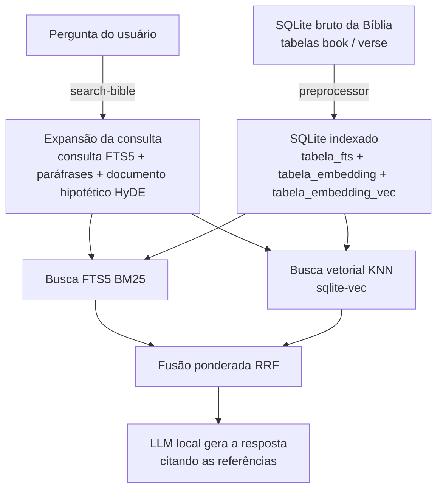

# RAG da Bíblia

RAG (Retrieval-Augmented Generation) **100% local** sobre o texto bíblico. O
projeto recupera capítulos e trechos relevantes para a pergunta do usuário —
combinando busca lexical (FTS5) e busca semântica (embeddings) — e usa um LLM
local para escrever a resposta citando testamento, livro, capítulo e versículo.

Todo o processamento (LLM, embeddings e contagem de tokens) roda através do
[LM Studio](https://lmstudio.ai/) na sua máquina. Nenhum dado sai do computador.

## Como funciona

O fluxo tem duas etapas: um **pré-processamento** que transforma um SQLite bruto
da Bíblia em um índice de busca, e a **busca** propriamente dita.



### Pré-processamento (`preprocessor`)

1. Lê os versículos do SQLite de entrada, agrupando-os por capítulo.
2. Divide cada capítulo em _chunks_ de no máximo **900 tokens**, contados com o
   tokenizer do modelo alvo (`@huggingface/transformers`). O corte é feito em
   nível de linha e cada chunk recomeça com a última linha do chunk anterior,
   garantindo _overlap_ de contexto.
3. Gera o embedding de cada chunk com o modelo de embeddings.
4. Grava tudo em três tabelas do SQLite de saída (veja
   [Esquema do banco indexado](#esquema-do-banco-indexado)).

### Busca (`search-bible`)

1. **Expansão da consulta** com o LLM local:
   - uma consulta `MATCH` válida para o FTS5 (validada contra o banco, com até 3
     tentativas);
   - até 3 paráfrases semânticas para a busca vetorial;
   - um documento hipotético (HyDE) que "parece" o trecho procurado — pode ser
     desligado com `--pular-hyde`.
2. **Busca lexical** no FTS5, ordenada por BM25.
3. **Busca vetorial** KNN com `sqlite-vec`, usando as paráfrases e o HyDE.
4. **Fusão** dos dois rankings com _Reciprocal Rank Fusion_ ponderado
   (`--peso-fts` / `--peso-vetorial`, constante `k = 60`).
5. O LLM redige a resposta final apenas com base nos trechos recuperados,
   citando as referências; se não encontrar, diz que não encontrou.

## Requisitos

- **Node.js 20+**
- **LM Studio** rodando com o servidor local ativo e os modelos abaixo baixados:
  - LLM: `google/gemma-4-12b-qat`
  - Embeddings: `text-embedding-multilingual-e5-large-instruct` (1024 dimensões)
- Acesso à internet **na primeira execução** do `preprocessor`, para baixar o
  tokenizer `google/gemma-4-12b` via Hugging Face.
- A extensão [`sqlite-vec`](https://github.com/asg017/sqlite-vec) é instalada
  automaticamente como dependência npm e carregada em tempo de execução.

Os identificadores dos modelos ficam centralizados em `src/helpers/modelos.ts`
(`MODELO_ALVO` e `MODELO_EMBEDDING_ALVO`), reutilizado pelo `preprocessor`, pelo
`search-bible`, pelo `token-counter` e pelo servidor web. Ajuste-os ali se quiser
usar outros modelos.

## Instalação

```bash
npm install
npm run build
```

Os comandos `npm run <script>` já executam `npm run build` antes de rodar.

## Onde conseguir um SQLite da Bíblia

**As traduções não são versionadas neste repositório.** O diretório
[`data/`](./data) fica vazio (a não ser pelos bancos que você mesmo gerar) e você
precisa baixar o texto bíblico à parte.

Use a coletânea de Bíblias em português de
[**damarals/biblias**](https://github.com/damarals/biblias), que disponibiliza 18
traduções em SQLite na última _release_ do projeto. Baixe o `.sqlite` da tradução
desejada e coloque-o em `data/` (ex.: `data/NAA.sqlite`).

> Confira se o banco baixado segue o esquema esperado (tabelas `book` e `verse`,
> descrito abaixo). Se estiver em outro formato, converta-o antes de rodar o
> `preprocessor`.

### Esquema esperado na entrada

O `preprocessor` lê as tabelas `book` e `verse`:

```sql
CREATE TABLE book (
    id INTEGER PRIMARY KEY,
    book_reference_id INTEGER,        -- ordem canônica do livro (1 = Gênesis)
    testament_reference_id INTEGER,   -- 1 = Antigo/Velho Testamento, 2 = Novo
    name VARCHAR(50)
);

CREATE TABLE verse (
    id INTEGER PRIMARY KEY,
    book_id INTEGER,                  -- FK para book.id
    chapter INTEGER,
    verse INTEGER,
    text TEXT
);
```

Uma tabela `metadata(name, dbversion)` pode existir, mas não é usada.

## Uso

### 1. Indexar a Bíblia — `preprocessor`

Baixe antes um SQLite de tradução (veja
[Onde conseguir um SQLite da Bíblia](#onde-conseguir-um-sqlite-da-bíblia)) e
coloque-o em `data/`.

```bash
npm run preprocessor -- --input ./data/NAA.sqlite --output ./data/preprocessed.sqlite
```

| Opção            | Descrição                                               |
| ---------------- | ------------------------------------------------------- |
| `--input`, `-i`  | SQLite bruto da Bíblia (obrigatório)                    |
| `--output`, `-o` | SQLite de saída, com as tabelas de índice (obrigatório) |
| `--help`         | Ajuda                                                   |

As tabelas de saída são recriadas a cada execução (`DROP TABLE IF EXISTS`).

### 2. Perguntar — `search-bible`

```bash
npm run searchBible -- \
  --input ./data/preprocessed.sqlite \
  --query "O que Jesus disse sobre perdão?"
```

| Opção              | Padrão  | Descrição                                         |
| ------------------ | ------- | ------------------------------------------------- |
| `--input`, `-i`    | —       | SQLite indexado pelo `preprocessor` (obrigatório) |
| `--query`, `-q`    | —       | Pergunta do usuário (obrigatório)                 |
| `--top-k`          | `5`     | Nº de trechos no resultado final                  |
| `--top-k-fts`      | `25`    | Nº de candidatos vindos do FTS5                   |
| `--top-k-vetorial` | `25`    | Nº de candidatos vindos da busca vetorial         |
| `--peso-fts`       | `0.5`   | Peso da busca lexical na fusão                    |
| `--peso-vetorial`  | `0.5`   | Peso da busca vetorial na fusão                   |
| `--pular-hyde`     | `false` | Não gerar o documento hipotético (HyDE)           |

Os pesos devem ser não-negativos e somar mais que zero.

### 3. Inspecionar tamanho dos capítulos — `token-counter`

Conta os tokens de cada capítulo e mostra os `N` capítulos com mais tokens. Lê
sempre `./data/preprocessed.sqlite`.

```bash
npm run tokenCounter -- 10
```

## Esquema do banco indexado

O `preprocessor` cria três tabelas no SQLite de saída:

### `tabela_fts` — virtual FTS5

| Coluna            | Uso                                    |
| ----------------- | -------------------------------------- |
| `numero_capitulo` | número do capítulo                     |
| `livro`           | nome do livro                          |
| `id_livro`        | `book_reference_id`                    |
| `testamento`      | "Velho Testamento" / "Novo Testamento" |
| `id_testamento`   | `testament_reference_id`               |
| `texto`           | texto do chunk                         |
| `indice_chunk`    | índice do chunk no capítulo            |

### `tabela_embedding` — metadados dos chunks

| Coluna            | Tipo                | Uso                                          |
| ----------------- | ------------------- | -------------------------------------------- |
| `id`              | INTEGER PRIMARY KEY |                                              |
| `numero_capitulo` | INTEGER             |                                              |
| `livro`           | TEXT                |                                              |
| `id_livro`        | INTEGER             | `book_reference_id`                          |
| `testamento`      | TEXT                |                                              |
| `id_testamento`   | INTEGER             |                                              |
| `texto`           | TEXT                | texto do chunk                               |
| `indice_chunk`    | INTEGER             |                                              |
| `vec_rowid`       | INTEGER             | referência à linha em `tabela_embedding_vec` |

### `tabela_embedding_vec` — virtual `vec0` (sqlite-vec)

Armazena os vetores: `embedding float(1024)`. A busca KNN usa
`WHERE embedding MATCH ? ORDER BY distance`, e a distância L2 é convertida em
similaridade de cosseno (`cosine = 1 - distância² / 2`, válido para embeddings
normalizados).

### Consultas úteis

```bash
sqlite3 ./data/preprocessed.sqlite
```

```sql
-- Total de chunks
SELECT COUNT(*) FROM tabela_embedding;

-- Chunks por livro
SELECT livro, COUNT(*) FROM tabela_embedding GROUP BY livro;

-- Busca lexical
SELECT livro, numero_capitulo, texto
FROM tabela_fts
WHERE tabela_fts MATCH 'perdão OR perdoar';
```

## Servidor + interface web

Além dos CLIs, o projeto traz um **servidor Express** e uma **interface React**
que reproduzem no navegador a mesma experiência do terminal — expansão da
consulta, trechos recuperados e resposta final, tudo em _streaming_.

O servidor vive em `src/server/` e a interface em `client/` (React + Vite).
Nenhuma lógica de busca é duplicada: o servidor reaproveita os mesmos helpers de
`src/helpers/` usados pelo `search-bible` (parâmetros, buscas FTS/vetorial e
fusão RRF).

### Arquitetura

```
client/                        React + Vite (CSS próprio, modal de trechos)
src/server/
  index.ts                     Boot: sobe o HTTP e carrega os modelos antes de aceitar buscas
  lib/pipeline.ts              Orquestra o mesmo fluxo do main() de searchBible.ts
  lib/instrumentarModelo.ts    Proxy no LLM para transmitir tokens sem tocar nos helpers
  lib/eventos.ts               Tipos dos eventos SSE trocados com o cliente
src/helpers/
  carregarParametrosBase.ts        Opções e validação de busca compartilhadas (CLI + servidor)
  carregarParametrosDoServidor.ts  Base + `--port`, sem `--query`
  search/fundirResultados.ts       Fusão RRF ponderada (usada pelo CLI e pelo servidor)
```

Antes existiam cópias de `buscarVetorial` e da fusão RRF dentro de `src/server/`
porque importar `src/searchBible.ts` executaria o seu `main()`. Essa lógica foi
extraída para `src/helpers/`, então hoje o servidor e o `search-bible`
compartilham exatamente o mesmo código de parâmetros, busca e fusão.

### O que o servidor faz

- **Express**, com os mesmos parâmetros do `search-bible` **exceto `--query`**
  (a consulta chega pela interface). `--port`/`-p` escolhe a porta.
- **Carrega os modelos antes de aceitar buscas.** O HTTP sobe imediatamente para
  o `/api/status` responder, mas `/api/search` devolve `503` enquanto os modelos
  não terminam de carregar.
- `GET /api/status` — estado (`carregando` / `pronto` / `erro`), nomes dos
  modelos e parâmetros ativos. HTTP 200 pronto, 503 carregando, 500 em erro.
- `GET /api/search?q=...` — **Server-Sent Events**, emitindo em tempo real:
  - `estado` — fase atual (`na-fila`, `expandindo-lexica`, `expandindo-parafrase`,
    `expandindo-hyde`, `buscando`, `fundindo`, `gerando`, `concluido`);
  - `expansao-fragmento` — tokens da expansão (canal `lexica` / `parafrase` /
    `hyde`) conforme a rede os gera;
  - `expansao-final` — as consultas consolidadas;
  - `trechos` — os trechos recuperados (texto completo e scores);
  - `resposta-fragmento` — tokens da resposta final;
  - `fim` / `erro`.
- O endpoint é **sem estado** e serializa as buscas (um único LLM local),
  processando uma de cada vez como no terminal.

### O que o cliente faz

- CSS próprio em `client/src/estilos.css`; componentes em `client/src/componentes/`.
- Mostra o **progresso da consulta** com os tokens de expansão aparecendo ao vivo.
- Mostra a **resposta final** em _streaming_.
- Lista os **trechos** recuperados; cada um abre um **modal** com o texto do
  capítulo e os scores.
- No texto da resposta, menções a `livro + capítulo` que correspondem a um
  trecho recuperado viram **links** que abrem esse mesmo modal.
- Envia uma pergunta por vez e mantém na tela o histórico das anteriores.

### Como rodar

Pré-requisitos: os mesmos do `search-bible` — LM Studio ativo com os modelos de
`src/helpers/modelos.ts` e um SQLite já indexado pelo `preprocessor`.

#### Desenvolvimento (dois processos)

```bash
# 1) API (escolha o banco indexado) — roda via tsx, sem build
npm run server -- --input ./data/preprocessed.sqlite

# 2) Interface (Vite, com proxy /api → :3000)
npm run client
```

Abra <http://localhost:5173>.

Atalho para subir os dois juntos (assume `./data/preprocessed.sqlite`):

```bash
npm run web
```

Se o servidor estiver em outra porta: `API_PORT=4000 npm run client`.

#### Produção (um processo)

```bash
npm run client:build        # gera client/dist
npm run server -- --input ./data/preprocessed.sqlite
```

Quando `client/dist` existe, o Express serve a interface em
<http://localhost:3000>. Rode sempre a partir da raiz do projeto (o servidor
procura `client/dist` a partir do diretório de trabalho).

`npm run build` também compila o servidor para `dist/server/`, caso prefira rodar
o JavaScript já compilado em vez do `tsx`:

```bash
npm run build
node ./dist/server/index.js --input ./data/preprocessed.sqlite
```

### Parâmetros do servidor

Iguais aos do `search-bible` (menos `--query`), mais `--port`:

| Opção              | Padrão  | Descrição                                |
| ------------------ | ------- | --------------------------------------- |
| `--input`, `-i`    | —       | SQLite indexado (obrigatório)           |
| `--port`, `-p`     | `3000`  | Porta HTTP (inteiro entre 1 e 65535)    |
| `--top-k`          | `5`     | Nº de trechos no resultado final        |
| `--top-k-fts`      | `25`    | Candidatos do FTS                       |
| `--top-k-vetorial` | `25`    | Candidatos da busca vetorial            |
| `--peso-fts`       | `0.5`   | Peso da busca lexical na fusão          |
| `--peso-vetorial`  | `0.5`   | Peso da busca vetorial na fusão         |
| `--pular-hyde`     | `false` | Não gerar o documento hipotético (HyDE) |

`--query` **não** é aceito: a consulta chega pela interface.

## Testes

```bash
npm test
```

Roda `npm run build` e depois o Jest (`ts-jest`, config em `jest.config.ts`).
Os testes cobrem os helpers de parsing de argumentos (do CLI e do servidor),
divisão em chunks, geração de consulta FTS5, paráfrases, HyDE e as consultas ao
banco.

## Estrutura do projeto

```
src/
  preprocessor.ts         # CLI: indexa o SQLite bruto
  searchBible.ts          # CLI: expande a consulta, busca, funde e responde
  tokenCounter.ts         # CLI: estatística de tokens por capítulo
  systemPrompts.ts        # prompts do LLM (FTS5, paráfrase, HyDE, resposta final)
  types.ts                # tipos dos resultados de busca
  helpers/
    modelos.ts                        # ids dos modelos LM Studio (fonte única)
    carregarParametrosBase.ts         # opções/validação de busca compartilhadas (CLI + servidor)
    carregarParametrosDoComando.ts    # parâmetros do search-bible (base + --query)
    carregarParametrosDoServidor.ts   # parâmetros do servidor web (base + --port)
    dividirEmChunks.ts                # chunking com overlap por linha
    montarChaveResultado.ts           # chave de deduplicação testamento|livro|capítulo|chunk
    serializarEmbeddingParaBuffer.ts  # embedding number[] → Buffer float32 (sqlite-vec)
    imprimirCapitulosEncontrados.ts   # impressão dos resultados
    search/                           # expansão da consulta (FTS5, paráfrase, HyDE), fusão RRF e carga de modelos
    consultasBanco/                   # buscarFts (BM25) e buscarVetorial (KNN)
  server/                 # servidor Express + SSE (ver "Servidor + interface web")
client/                   # interface React + Vite
data/                     # não versionado: coloque aqui o SQLite da tradução e os bancos indexados
```
